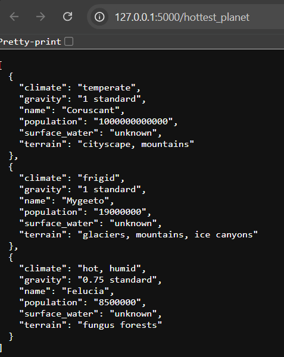

## 🛸 Desafio 2: Star Wars API Project

Aqui você encontra o desafio 2, este projeto é uma API desenvolvida em Flask para buscar e armazenar dados de planetas, personagens e naves da franquia Star Wars. Os dados são obtidos de uma API externa e armazenados em um banco de dados SQLite. A API oferece endpoints para acessar as informações sobre o planeta mais quente, o personagem que mais aparece e as naves mais rápidas.


### Estrutura do projeto

```bash
.
├── app.py               # Arquivo principal para execução da aplicação Flask
├── databases.py         # Lida com a criação de conexões e armazenamento de dados no banco de dados SQLite
├── data_fetchers.py     # Contém funções para buscar dados da API externa
├── models.py            # Contém consultas ao banco de dados para responder aos endpoints
├── routes.py            # Define as rotas/endpoints da aplicação Flask
├── test_models.py       # Testes para o modelo e banco de dados
├── test_routes.py       # Testes para as rotas da API
├── requirements.txt     # Lista de dependências do projeto
└── README.md            # Este arquivo
```


### Pré-requisitos
Antes de executar o projeto, você precisa instalar as dependências.

1. Clone o repositório para o seu ambiente local:
```bash
git clone https://github.com/brenda00/teste_tecnico.git
cd star-wars-api
```

3. Crie um ambiente virtual (opcional, mas recomendado):
```bash
python -m venv venv
source venv/bin/activate   # No Windows: venv\Scripts\activate
```

4. Instale as dependências necessárias:
```bash
pip install -r requirements.txt
```

## Executando o projeto

1. Certifique-se de que as dependências estão instaladas.

2.Execute o arquivo principal app.py para iniciar a API Flask:
```bash
python app.py
```

3. O servidor Flask será iniciado no endereço http://127.0.0.1:5000. Por padrão deixei para abrir automaticamente no endpoint /hottest_planet, você consegue acessar os demais endpoints assim: http://127.0.0.1:5000/appears_most e http://127.0.0.1:5000/fastest_ships. Ao executar o projeto com sucesso você vai ter uma visão como a do print abaixo.



## Testes
O projeto inclui testes para garantir o funcionamento correto das rotas e do banco de dados.

1. Testes de Modelos (test_models.py) e Teste do banco de dados (test_database.py): Testam o armazenamento de dados e as consultas ao banco de dados.

2. Testes de Rotas (test_routes.py): Testam as respostas das rotas/endpoints.
3. Para executar o teste utilize:  

    ```bash
    python -m unittest test_models.py
    python -m unittest test_database.py
    ```
4. Ao executar o teste com sucesso você deve receber um retorno como esse:


    
### Observações

- Os testes são executados utilizando o framework `unittest`, que é integrado ao Python.
- Certifique-se de que o Flask não está rodando no mesmo ambiente ao executar os testes para evitar conflitos de porta ou interferência.

  

  
